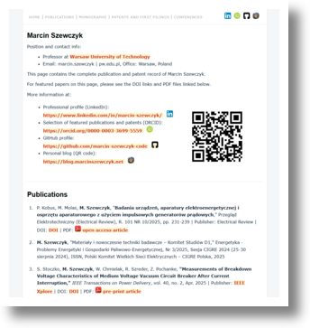

# minimal-academic-homepage

Minimalist academic homepage implemented in pure HTML 4.01 and CSS 2.1.

Deliberately simple, fully static, and framework-free.

## Features
- Single-page static layout with internal anchor navigation (Home / Publications / ... )
- Fixed top navigation bar followed by basic info with QR code
- CSS 2.1-friendly conservative styling
- Easy to modify and extend manually

## Structure
- `index.html` – main page
- `style.css` – styles
- `img/` – icons and images
- `pdf/` – documents
  - `papers/` – publications (pre-prints)
  - `patents/` – patents and first filings
- `assets/` – repository assets (e.g., README screenshots)

## Local preview
Just open `index.html` in a browser. Make sure `style.css` is located in the same directory.

## Live example

The layout is currently used on my personal academic homepage:

[https://www.ee.pw.edu.pl/~szewczyk/](https://www.ee.pw.edu.pl/~szewczyk/)

This repository contains a cleaned and reusable template version of that layout.

## Preview

## License

MIT License. See `LICENSE` file for details.
